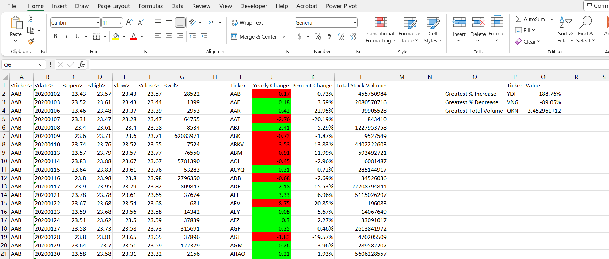

# VBA-Challenge

---

# Stock Analysis VBA Script

## Overview
This VBA script performs stock analysis on multiple worksheets in an Excel workbook. It calculates metrics for each stock, including yearly change, percent change, and total stock volume. Results are displayed in a summary table, and the script identifies the stocks with the greatest percentage increase, greatest percentage decrease, and greatest total volume.

## Output
Summary table columns:
- Ticker: Stock ticker symbol
- Yearly Change: Change in stock price over the year
- Percent Change: Percentage change in stock price over the year
- Total Stock Volume: Total trading volume

Also identified:
- Greatest % Increase: Stock with the highest percentage increase
- Greatest % Decrease: Stock with the highest percentage decrease
- Greatest Total Volume: Stock with the highest total trading volume

## Notes
- in this challenge used online resources, teammates ,instructor, tutor  assistance. 
